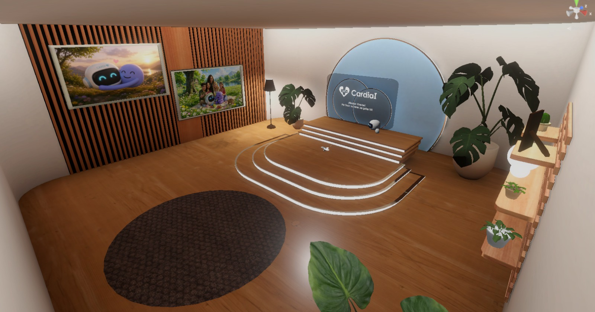

# 🫀 CardiaI VR Experience

> *Aprendiendo a escuchar el corazón.*
> Una experiencia inmersiva de realidad virtual para aprender el uso de un electrocardiógrafo portátil con IA.

---

## Índice

- [Visión general](#visión-general)
- [El problema real](#-el-problema-real)
- [Flujo de la experiencia](#flujo-de-la-experiencia)
- [Salas de la experiencia](#salas-de-la-experiencia)
- [Demo y videos](#demo-y-videos)
- [Tecnologías utilizadas](#tecnologías-utilizadas)
- [Equipo](#equipo)

---

## Visión general

**CardiaI VR Experience** es una aplicación de realidad virtual diseñada para enseñar a estudiantes universitarios a usar un electrocardiógrafo portátil (CAI-100) que detecta arritmias mediante inteligencia artificial.

El usuario es acompañado por **Cardi**, un robot guía con animaciones que lo hacen sentir cálido y cercano, mientras **Buba** (personaje creado para campañas) le habla desde fuera de la experiencia a través de un audífono, creando una dinámica de guía dual.

### Características principales

| Característica | Descripción |
| :--- | :--- |
| **Iluminación baked** | Salas con luces horneadas para una atmósfera inmersiva y optimizada |
| **Efectos AV** | Visuales y sonoros que refuerzan cada interacción |
| **Subtítulos** | En español, sincronizados con cada locución |
| **Hand tracking** | Completo, sin necesidad de controles |
| **Indicaciones multimodal** | Auditivas, visuales y hápticas que guían sin confusión |

---

## 💔 El problema real

### Contexto

Las enfermedades cardiovasculares son la **principal causa de muerte en el mundo** — 19.8 millones de muertes en 2022. En Costa Rica, el infarto agudo de miocardio representó el **7.22%** de las defunciones en 2024.

### Brecha identificada

Nuestra investigación de campo (encuesta **n = 80**) reveló:

| Hallazgo | % |
| :--- | :---: |
| Solo se hacen chequeos cuando se sienten mal | **50%** |
| Ansiedad al esperar un diagnóstico | **58.8%** |
| Usarían un dispositivo de monitoreo en casa | **86.4%** |
| Consideran VR útil para capacitación | **> 60%** |

> A través de un entorno calmado y actividades lúdicas, el usuario aprende a usar el dispositivo sin miedo ni presión.

---

## Flujo de la experiencia

**Ver Journey Map completo:** [`Assets/Images/journeyMap.pdf`](Assets/Images/journeyMap.pdf)

A través de **6 escenas**, el usuario recorre:

1. **Gestos básicos** — Aprende a agarrar, soltar y presionar en VR
2. **Armado del dispositivo** — Ensambla el CAI-100 pieza por pieza
3. **Medición simulada** — Realiza una medición de 10 segundos
4. **Activación del corazón** — Toca los nodos eléctricos en secuencia (SA → AV → Haz de His)
5. **Exploración de resultados** — Descubre los 3 posibles diagnósticos (Bradicardia, Taquicardia, FA)
6. **Premio simbólico** — Recibe una paleta de corazón al completar la experiencia

---

## Salas de la experiencia

### Lobby inicial

---

### Armado del dispositivo

---

### Medición simulada

---

### Corazón activado

---

## Demo y videos

| Recurso | Enlace |
| :--- | :--- |
| 🎞️ Animatic de la experiencia | [Ver Animatic](https://www.youtube.com/watch?v=cKkuyfXgMAw) |
| ▶️ Run completo de la experiencia | [Ver en YouTube](https://www.youtube.com/watch?v=Ha26-MzZjHI) |

---

## Tecnologías utilizadas

| Área | Tecnología |
| :--- | :--- |
| **Motor** | Unity 6.3 LTS (6000.3.10F1) |
| **Render** | URP |
| **Hand tracking** | Meta XR All-in-One SDK |
| **Subtítulos** | Sistema personalizado |
| **Locución** | ElevenLabs |
| **Modelado 3D** | Blender |

---

## Equipo

| Persona | Rol |
| :--- | :--- |
| Carlos Ávalos | Desarrollador |
| Daniel Zeas | Asistente de desarrollo |
| Sandy Paola Pinzón | Diseñadora |
| Gabriela Salazar | Diseñadora |
| Sara Sibaja | Diseñadora |

---